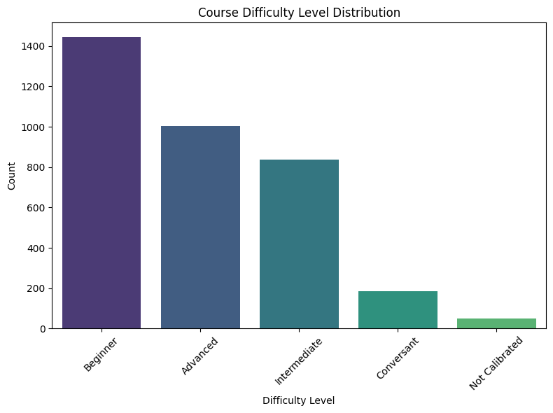
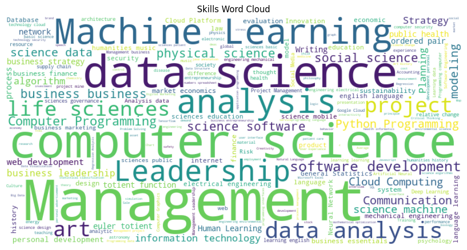

# Laporan Proyek Machine Learning - Rosyd Panjie Laras

## Project Overview

Dalam era digital saat ini, pembelajaran online telah menjadi bagian penting dari pendidikan dan pengembangan pribadi. Platform pembelajaran online, seperti Coursera, telah memberikan akses luas kepada ribuan kursus dari berbagai bidang dan disajikan dengan cara yang mudah diakses oleh pengguna. Namun, keberagaman besar kursus yang tersedia sering kali menjadi tantangan bagi pengguna dalam menemukan kursus yang paling sesuai dengan minat, kebutuhan, dan tujuan belajar mereka.

Proyek ini bertujuan untuk mengatasi tantangan tersebut dengan mengembangkan sebuah sistem rekomendasi yang cerdas dan efektif menggunakan metode content-based filtering. Dengan menggunakan pendekatan ini, proyek ini akan membantu pengguna Coursera dalam menavigasi melalui kerumitan pilihan kursus dan memberikan rekomendasi yang personal dan relevan berdasarkan analisis konten kursus.

## Business Understanding

### Problem Statements

Bagaimana cara mengembangkan sistem rekomendasi yang dapat merekomendasikan kursus-kursus yang relevan dengan preferensi pengguna di Coursera?

### Goals

Mengembangkan sistem rekomendasi menggunakan pendekatan content-based filtering untuk memberikan rekomendasi kursus yang paling sesuai dengan minat dan kebutuhan belajar pengguna. Dengan model ini, diharapkan pengguna Coursera dapat lebih efisien dalam menemukan kursus-kursus yang relevan dengan minat mereka, mengoptimalkan waktu belajar, dan mencapai tujuan pembelajaran dengan lebih baik.

### Solution Approach

Solusi yang diajukan dalam proyek ini mencakup langkah-langkah berikut:

- Pengumpulan dan Pembersihan Data: Langkah pertama adalah mengumpulkan dataset yang berisi informasi tentang kursus-kursus di platform Coursera, termasuk atribut-atribut seperti nama kursus, deskripsi, keterampilan yang diajarkan, dan tingkat kesulitan. Setelah itu, kami akan melakukan pembersihan data dengan mengatasi nilai yang hilang atau duplikat yang mungkin memengaruhi kualitas rekomendasi.

- Teknik Preprocessing: Preprocessing dilakukan untuk memastikan data siap digunakan dalam melatih dan menguji model. Langkah-langkah dalam tahapan ini meliputi:
    1. Menghapus duplikat pada kolom 'Course Name'
    2. Menghapus nilai 'Not Calibrated'
    3. Mengubah tipe data 'Course Rating' menjadi float
    4. Menggabungkan nilai dari kolom 'Course Description', 'Skills', dan 'Difficulty Level',
    5. Menghapus tanda baca, tanda kurung, dan karakter khusus lainnya.

- Pengembangan model rekomendasi: Model dikembangkan dengan menerapkan metode content-based filtering menggunakan pendekatan TF-IDF (Term Frequency-Inverse Document Frequency) untuk menganalisis konten kursus. Penghitungan kemiripan kosinus antara kursus dilakukan berdasarkan matriks TF-IDF. 

## Data Understanding

Dataset yang digunakan berasal dari sumber Kaggle dan dapat diunduh melalui tautan berikut: (https://www.kaggle.com/datasets/khusheekapoor/coursera-courses-dataset-2021).

Nama dataset : Coursera Courses Dataset 2021

Penulis : Khushee Kapoor

Dataset ini diperoleh dengan mengambil informasi yang tersedia di situs Coursera pada bulan September 2021 dan diinput secara manual jika terjadi kesalahan pengambilan data. Tujuan dari dataset Coursera Courses 2021 adalah untuk menyediakan informasi tentang berbagai kursus yang ditawarkan di platform Coursera. Dataset ini bertujuan untuk mendukung pengembangan Sistem Rekomendasi yang dapat memberikan rekomendasi kursus kepada pengguna berdasarkan tingkat kesulitan, keterampilan yang dibutuhkan, dan konten kursus.

Berikut adalah rincian fitur yang ada dalam dataset:
**Feature**:
- Course Name: Berisi nama-nama berbagai kursus yang ditawarkan di platform coursera. Nama kursus berfungsi sebagai pengenal utama bagi pengguna dan menjadi dasar untuk rekomendasi kursus.
- Course Description: Gambaran ringkas tentang konten dan tujuan dari setiap kursus. Kursus-kursus dengan deskripsi serupa cenderung relevan bagi pengguna yang telah menunjukkan minat pada kursus tertentu.
- Skills: Menggambarkan kemampuan atau bidang pengetahuan tertentu yang ingin ditanamkan oleh kursus-kursus tersebut. Pengguna mungkin menginginkan rekomendasi berdasarkan keterampilan yang sama, yang mencerminkan minat profesional atau pribadi mereka.
- Difficulty Level: Kursus-kursus dikategorikan ke dalam tingkatan kesulitan yang berbeda, seperti pemula, menengah, dan lanjutan. Rekomendasi kursus dengan tingkat kesulitan yang serupa memastikan bahwa pengguna menerima rekomendasi yang sesuai dengan keahlian dan tujuan pembelajaran mereka saat ini.
- Course Ratings: Angka penilaian untuk kursus, meskipun bisa memiliki bias dan distribusi yang tidak merata, namun dapat memberikan panduan tentang popularitas dan kualitas relatif suatu kursus.
- University: Kolom ini mencatat universitas yang menyelenggarakan kursus tersebut. Namun, informasi ini tidak selalu relevan untuk rekomendasi karena pengguna mungkin lebih tertarik pada topik atau konten tertentu daripada asal universitas.
- Course URL: Berisi tautan URL ke halaman kursus di Coursera. Meskipun penting untuk mengakses kursus, informasi ini tidak diperlukan dalam proses rekomendasi dan tidak mempengaruhi kesesuaian konten kursus.

Tingkat Kesulitan Course

Data menunjukkan variasi tingkat kesulitan kursus Coursera. Terdapat 1444 kursus pemula, 1005 kursus lanjutan, dan 837 kursus menengah. Ada juga 186 kursus "Conversant", 50 kursus belum dikalibrasi kesulitannya. Informasi ini membantu pengguna memilih kursus sesuai level pemahaman, meningkatkan efektivitas pembelajaran.

Word Cloud Pada Kolom Skills

Dari word cloud yang dihasilkan, lima kata yang paling sering muncul dalam deskripsi kursus adalah 'Management', 'Computer Science', 'Data Science', 'Machine Learning', and 'Analysis'. Kata-kata ini mencerminkan tema dan topik yang dominan dalam kursus-kursus di dalam dataset. Kehadiran istilah seperti 'Management', 'Computer Science', and 'Data Science' menunjukkan fokus yang kuat pada subjek bisnis dan teknologi. Selain itu, kata 'Machine Learning' dan 'Analysis' mengindikasikan penekanan yang signifikan pada bidang berbasis data dan analitik. Temuan ini memberikan wawasan tentang area minat dan keahlian utama yang ditawarkan oleh kursus-kursus di Coursera, membantu dalam memahami lanskap konten dalam dataset.

## Data Preparation
Tahap persiapan data dilakukan untuk memastikan bahwa data siap digunakan dalam pelatihan dan pengujian model rekomendasi. Berikut adalah urutan teknik data preparation yang diterapkan:

1. Penghapusan Data Duplikat: Data duplikat pada kolom "Course Name" dihapus untuk memastikan setiap kursus hanya muncul sekali dalam dataset. Langkah ini dilakukan untuk menghindari duplikasi yang tidak perlu dalam proses rekomendasi.
2. Pembersihan Data: Data dengan nilai "Not Calibrated" pada kolom "Course Rating" dihapus, karena nilai ini tidak memberikan informasi yang berguna dan dapat mempengaruhi hasil rekomendasi.
3. Pengubahan Tipe Data: Tipe data kolom "Course Rating" diubah menjadi tipe data numerik (float) agar dapat diolah dengan benar dalam analisis selanjutnya.
4. Penggabungan Konten: Konten dari kolom "Course Description", "Skills", dan "Difficulty Level" digabungkan menjadi satu teks yang menggambarkan informasi lengkap tentang kursus. Langkah ini memungkinkan model untuk memahami dan menganalisis karakteristik kursus dengan lebih baik.
5. Penghapusan Karakter Khusus: Karakter khusus seperti tanda baca, kurung, dan karakter khusus lainnya dihapus dari teks yang digabungkan. Hal ini dilakukan untuk menghindari gangguan yang tidak perlu dalam analisis teks.

## Modeling
**Pemilihan Algoritma**

TF-IDF adalah metode yang digunakan untuk mengukur seberapa penting suatu kata dalam suatu dokumen dalam konteks koleksi dokumen yang lebih besar. Pendekatan ini sangat relevan dalam content-based filtering karena menggambarkan bobot relatif kata-kata dalam konten kursus.

Alasan utama menggunakan TF-IDF dalam content-based filtering adalah sebagai berikut:

1. Penekanan pada Kata Penting: TF-IDF memberikan bobot lebih besar pada kata-kata yang jarang muncul di seluruh koleksi dokumen tetapi muncul berkali-kali dalam dokumen tertentu. Ini berarti kata-kata yang khas dan penting untuk suatu kursus akan memiliki bobot yang lebih tinggi, dan karenanya, akan memberikan kontribusi lebih besar dalam mengukur kemiripan antara kursus.
2. Pengabaian Kata Umum: Kata-kata umum yang muncul di banyak dokumen (seperti "dan", "atau", "itu", dll.) memiliki bobot TF-IDF yang rendah, karena mereka kurang membantu dalam menggambarkan karakteristik khusus suatu kursus. Ini membantu dalam menghindari pemilihan kata-kata yang tidak relevan dalam perhitungan kemiripan.
3. Pemahaman Konten yang Lebih Baik: TF-IDF memungkinkan model untuk memahami dan menganalisis lebih baik tentang konten kursus. Kata-kata yang khas bagi suatu kursus akan memiliki dampak yang lebih besar dalam perhitungan kemiripan, sehingga kursus dengan karakteristik konten yang serupa lebih mungkin direkomendasikan.
4. Fleksibilitas: Pendekatan TF-IDF dapat diterapkan pada berbagai jenis konten, termasuk teks dalam deskripsi kursus. Ini menjadikannya metode yang dapat digunakan dalam berbagai domain dan aplikasi.

Dengan menggunakan TF-IDF, sistem rekomendasi content-based filtering mampu mengidentifikasi dan merekomendasikan kursus dengan karakteristik konten yang serupa, meningkatkan akurasi dan relevansi rekomendasi yang diberikan kepada pengguna.

**Proses Modeling**

Dalam tahap ini, dilakukan pengembangan model sistem rekomendasi menggunakan pendekatan content-based filtering dengan algoritma TF-IDF (Term Frequency-Inverse Document Frequency). Pendekatan ini memungkinkan rekomendasi kursus kepada pengguna berdasarkan kesesuaian konten kursus dengan minat dan preferensi pengguna.

Tahapan proses modeling :
1. Pembuatan Vektor Representasi TF-IDF: Proses pertama melibatkan mengubah konten kursus menjadi vektor representasi TF-IDF. Langkah ini melibatkan pemberian bobot pada setiap kata dalam konten kursus, menggambarkan tingkat kepentingan kata dalam dokumen tersebut.
2. Perhitungan Kemiripan Kosinus: Kemiripan osinus digunakan untuk mengukur sejauh mana dua vektor representasi kursus mirip satu sama lain. Ini membantu dalam menentukan seberapa sesuai konten kursus antara kursus yang dipilih oleh pengguna dan kursus lain dalam dataset.
3. Metode recommend(): Metode ini mengimplementasikan perhitungan kemiripan kosinus untuk memilih kursus-kursus yang memiliki kemiripan tertinggi dengan kursus yang dipilih oleh pengguna. Pertama, dihitung kemiripan kosinus antara vektor representasi kursus pilihan pengguna dengan vektor representasi semua kursus dalam dataset. Kursus-kursus dengan kemiripan tertinggi diidentifikasi dan direkomendasikan kepada pengguna. Metode ini membantu pengguna menemukan kursus-kursus yang sesuai dengan minat dan preferensi mereka, dengan mempertimbangkan kesamaan konten antara kursus-kursus tersebut.

Dengan menggunakan pendekatan ini, sistem rekomendasi mampu memberikan rekomendasi kursus yang sesuai dengan minat dan preferensi pengguna berdasarkan analisis konten kursus. Hasilnya adalah rekomendasi top-N kursus yang dapat membantu pengguna dalam menemukan pilihan kursus yang relevan dan bermanfaat.

| Recommended Course                                   	| Course Rating   	| Similarity Score 	|
|------------------------------------------------------	|------------------	|------------------	|
| Retrieve Data using Single-Table SQL Queries         	| 4.6             	| 1.00             	|
| Creating Database Tables with SQL                    	| 4.6             	| 0.58             	|
| Create Relational Database Tables Using SQLiteStudio 	| 4.7             	| 0.55             	|
| Manipulating Data with SQL                           	| 4.6             	| 0.54             	|
| Advanced SQL Retrieval Queries in SQLiteStudio       	| 4.6             	| 0.50             	|
| Querying Databases Using SQL SELECT statement        	| 4.6             	| 0.48             	|
| Advanced Relational Database and SQL                 	| 4.6             	| 0.48             	|
| Build a Database from a Relational Model             	| 4.8             	| 0.48             	|
| Intermediate Relational Database and SQL             	| 4.4             	| 0.48             	|
| Databases and SQL for Data Science                   	| 4.6             	| 0.47             	|

## Evaluation

Pada tahap evaluasi ini, metrik presisi dan recall digunakan untuk mengukur performa model sistem rekomendasi berbasis konten yang telah dibuat. Kursus-kursus yang direkomendasikan dengan skor kemiripan di atas 4.5 dianggap "relevant" berdasarkan rata-rata rating tinggi. Dengan menghitung jumlah kursus "relevant" dan kursus yang direkomendasikan yang juga "relevant", presisi dan recall dapat dihitung.

| Statistik Rating Kursus | Nilai           |
|-------------------------|-----------------|
| Jumlah Data             | 3334            |
| Rata-rata (Mean)        | 4.552220        |
| Standar Deviasi (Std)   | 0.340927        |
| Minimum                 | 1.000000        |
| Kuartil 25%             | 4.500000        |
| Kuartil 50% (Median)    | 4.600000        |
| Kuartil 75%             | 4.800000        |
| Maksimum                | 5.000000        |

Data statistik rating kursus menunjukkan bahwa mean (rata-rata) rating kursus adalah sekitar 4.55. Dengan mengambil pendekatan ini, kursus-kursus yang memiliki rating di atas atau sama dengan mean (4.55) dianggap sebagai kursus yang relevan dan memiliki kualitas yang baik. Oleh karena itu, batas minimal rating 4.5 digunakan sebagai kriteria "relevant" untuk rekomendasi kursus.

| Metric    | Value |
|-----------|-------|
| Precision | 0.9   |
| Recall    | 1     |

Hasil evaluasi model menunjukkan nilai presisi sebesar 0.9 dan nilai recall sebesar 1.0. Nilai presisi yang tinggi (0.9) menunjukkan bahwa sebagian besar kursus yang direkomendasikan oleh sistem memang relevan dengan minat dan preferensi pengguna. Dengan kata lain, sekitar 90% dari kursus-kursus yang direkomendasikan memang memiliki tingkat relevansi yang tinggi dengan kursus-kursus yang sebenarnya dianggap "relevant" berdasarkan rating tinggi.

Sementara itu, nilai recall yang tinggi (1.0) mengindikasikan bahwa sistem mampu menemukan dan merekomendasikan semua kursus yang sebenarnya relevan bagi pengguna. Dalam konteks ini, sistem berhasil mengidentifikasi seluruh kursus yang memiliki rating tinggi (di atas 4.5) sebagai kursus yang sebenarnya relevan, sehingga nilai recall mencapai 1.0.

Hasil ini menunjukkan bahwa model content-based filtering dengan menggunakan metode TF-IDF dan perhitungan kemiripan kosinus telah berhasil menghasilkan rekomendasi kursus yang memiliki kualitas tinggi, dengan presisi yang baik dan kemampuan untuk menemukan semua kursus yang sebenarnya relevan. Dengan demikian, model ini dapat dianggap sebagai solusi yang efektif dalam memberikan rekomendasi kursus kepada pengguna dengan mempertimbangkan kesesuaian konten kursus dengan minat dan preferensi mereka.

## Conclusion

Dalam proyek ini, berhasil dikembangkan sebuah sistem rekomendasi berbasis konten untuk kursus-kursus di platform Coursera. Pendekatan content-based filtering dengan menggunakan metode TF-IDF dan perhitungan kemiripan kosinus terbukti efektif dalam memberikan rekomendasi kursus kepada pengguna.

Rekomendasi Pengembangan Lebih Lanjut:
- Pengembangan Algoritma: Eksplorasi algoritma rekomendasi lainnya, seperti collaborative filtering, dapat diperluas untuk meningkatkan kualitas rekomendasi.
- Personalisasi Lebih Lanjut: Pertimbangkan implementasi personalisasi yang lebih dalam, termasuk riwayat aktivitas pengguna, untuk pengalaman rekomendasi yang lebih kaya.
- Interaksi Pengguna: Integrasi mekanisme umpan balik pengguna terhadap rekomendasi dapat membantu menghasilkan rekomendasi yang lebih sesuai dengan preferensi individu.