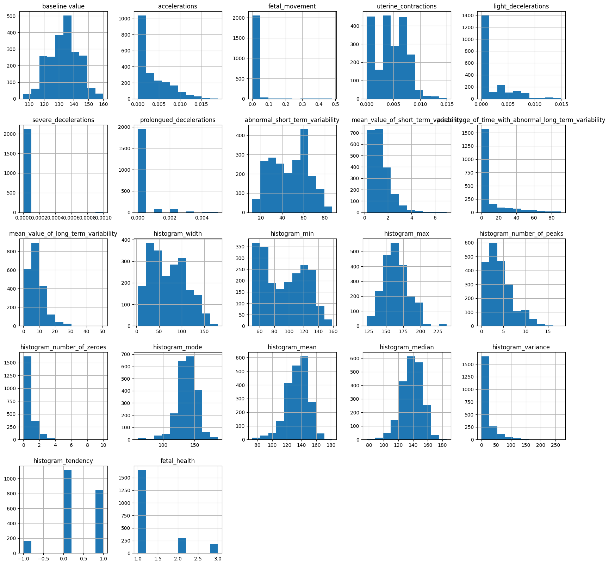
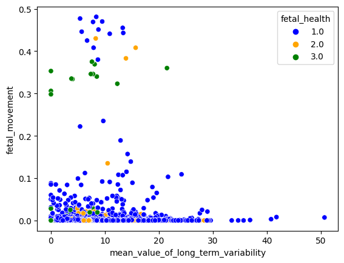

# Laporan Proyek Machine Learning - Rosyd Panjie Laras

## Project Overview

Deteksi dini kondisi kesehatan janin sangat penting dalam konteks perawatan ibu hamil karena membantu mencegah potensi risiko dan komplikasi yang dapat membahayakan kesehatan ibu dan janin. Janin dalam kandungan rentan terhadap berbagai faktor risiko dan perubahan kondisi yang dapat mempengaruhi kesehatannya. Dengan mendeteksi masalah kesehatan janin secara dini, tenaga medis dapat mengambil langkah-langkah yang tepat untuk mengurangi risiko dan mengoptimalkan perawatan.

Ketika masalah kesehatan janin terdeteksi lebih awal, intervensi medis yang tepat waktu dapat dilakukan. Misalnya, jika terjadi fluktuasi abnormal dalam detak jantung janin atau aktivitas gerakan, tenaga medis dapat melakukan evaluasi lebih lanjut atau mengambil langkah-langkah korektif untuk menghindari komplikasi lebih lanjut. Deteksi dini juga memungkinkan penilaian kondisi kesehatan ibu hamil secara keseluruhan, sehingga tindakan yang sesuai dapat diambil untuk menjaga kesehatan dan kenyamanannya.

Selain itu, model ini juga dapat meningkatkan komunikasi antara pasien dan tenaga medis, memberikan pemahaman yang lebih baik tentang kondisi kesehatan janin, dan membantu ibu hamil dalam mengambil keputusan yang tepat untuk kesejahteraan mereka dan bayi yang akan lahir. 

## Business Understanding

### Problem Statements

Bagaimana cara mengembangkan model machine learning yang memiliki kemampuan untuk mendeteksi dini kondisi kesehatan janin berdasarkan data medis yang tersedia?

### Goals

Tujuan utama dari proyek ini adalah menciptakan model klasifikasi yang mampu mengenali berbagai kondisi kesehatan janin, seperti risiko gagal jantung, dengan memanfaatkan fitur-fitur medis yang terdapat dalam dataset. Dengan hadirnya model ini, diharapkan tenaga medis mampu mengambil langkah pencegahan atau intervensi yang lebih awal dan lebih tepat.

### Solution Approach

Solusi yang diajukan dalam proyek ini mencakup langkah-langkah berikut:

- Pengumpulan dan Pembersihan Data: Langkah awal melibatkan pengumpulan dataset yang berisi data medis terkait kesehatan janin. Data tersebut akan menjelaskan informasi klinis dan fisiologis yang relevan, seperti denyut jantung janin, gerakan janin, tekanan darah ibu, dan elemen lainnya. Data ini kemudian akan dibersihkan dengan mengatasi nilai kosong atau outliers.

- Teknik Preprocessing: Preprocessing dilakukan untuk memastikan data siap digunakan dalam melatih dan menguji model. Tahapan ini mencakup pembersihan data dengan menghapus nilai-nilai yang tidak valid dan penanganan outliers.

- Pengembangan Model Klasifikasi: Model klasifikasi akan dibangun menggunakan algoritma machine learning yang telah dipilih yaitu K-Nearest Neighbors (KNN), Random Forest, dan Decision Tree yang sesuai dengan karakteristik dan kebutuhan masalah deteksi kesehatan janin.

- Pelatihan Model: Model akan dilatih menggunakan data pelatihan dengan menerapkan Stratified K-Fold cross-validation, sambil menjalani proses GridSearch untuk mencari kombinasi optimal dari hyperparameter. Hal ini bertujuan untuk mengoptimalkan performa model dengan memilih konfigurasi hyperparameter yang terbaik dan menghindari bias serta varian yang tidak diinginkan.

- Evaluasi Model: Performa model akan dievaluasi menggunakan metrik-metrik seperti akurasi, presisi, recall, dan F1-score dengan menggunakan data pengujian.

## Data Understanding

Dataset yang digunakan berasal dari sumber Kaggle dan dapat diunduh melalui tautan berikut: (https://www.kaggle.com/datasets/andrewmvd/fetal-health-classification).

Nama dataset : Fetal Health Classification
Penulis : Larxel

Data yang digunakan berasal dari hasil pemeriksaan Cardiotocogram (CTG) yang mencakup berbagai atribut seperti baseline Fetal Heart Rate (FHR), akselerasi, gerakan janin, kontraksi uterus, dan lain-lain. Atribut ini mencerminkan berbagai aspek kesehatan janin selama periode kehamilan. Dataset ini terdiri dari 2126 rekaman yang telah dianalisis oleh para ahli dan diklasifikasikan ke dalam tiga kelas: "Normal", "Suspect", dan "Pathological".

Berikut adalah rincian fitur yang ada dalam dataset:
**Feature**:
- 'baseline value': Baseline FHR (denyut jantung janin) dalam ketukan per menit.
- 'accelerations': Jumlah percepatan denyut jantung per detik.
- 'fetal_movement': Jumlah gerakan janin per detik.
- 'uterine_contractions': Jumlah kontraksi rahim per detik.
- 'light_decelerations': Jumlah penurunan ringan FHR per detik.
- 'severe_decelerations': Jumlah penurunan berat FHR per detik.
- 'prolongued_decelerations': Jumlah penurunan berkepanjangan FHR per detik.
- 'abnormal_short_term_variability': Persentase waktu dengan variasi jangka pendek yang abnormal.
- 'mean_value_of_short_term_variability': Nilai rata-rata variasi jangka pendek.
- 'percentage_of_time_with_abnormal_long_term_variability': Persentase waktu dengan variasi jangka panjang yang abnormal.
- 'mean_value_of_long_term_variability': Nilai rata-rata variasi jangka panjang.
- 'histogram_width': Lebar histogram FHR.
- 'histogram_min': Nilai minimum (frekuensi rendah) dalam histogram FHR.
- 'histogram_max': Nilai maksimum (frekuensi tinggi) dalam histogram FHR.
- 'histogram_number_of_peaks': Jumlah puncak dalam histogram FHR.
- 'histogram_number_of_zeroes': Jumlah nol dalam histogram FHR.
- 'histogram_mode': Modus (nilai paling sering muncul) dalam histogram FHR.
- 'histogram_mean': Nilai rata-rata dalam histogram FHR.
- 'histogram_median': Nilai tengah (nilai di tengah urutan data) dalam histogram FHR.
- 'histogram_variance': Variansi (sebaran) dalam histogram FHR.
- 'histogram_tendency': Kecenderungan (arah) dalam histogram FHR.

**Target**:
Fitur target dalam dataset adalah **'fetal_health'**, yang diberi label sebagai berikut:
- 1:Normal
- 2:Sangat diduga (Suspect)
- 3:Patologis

Contoh interpretasi naik turunnya baseline Fetal Heart Rate (FHR) dalam kondisi kesehatan janin:

- Normal: Naik turunnya FHR dalam kisaran yang stabil dan teratur menunjukkan adaptasi normal janin terhadap aktivitas dan perubahan posisi. Ini mencerminkan kondisi janin yang sehat.
- Suspect: Jika FHR memiliki fluktuasi yang tidak konsisten atau tiba-tiba meningkat atau menurun secara drastis, ini dapat mengindikasikan potensi masalah kesehatan janin. Hal ini memerlukan evaluasi lebih lanjut oleh tenaga medis.
- Pathological: Jika FHR menunjukkan pola yang tidak normal, seperti tachycardia (detak jantung lebih cepat dari biasanya) atau bradycardia (detak jantung lebih lambat dari biasanya), ini dapat menunjukkan masalah serius pada kesehatan janin dan memerlukan perawatan segera.

Feature Distribution

Hal penting dari plot di atas adalah Skewness, yang mengukur asimetri distribusi probabilitas variabel acak. Ada tiga jenis distribusi condong: kanan (positif), kiri (negatif), dan normal.

- Distribusi condong kiri memiliki ekor kiri yang panjang, disebut juga distribusi negatif. Rata-rata ada di sebelah kiri puncak.
- Distribusi condong kanan memiliki ekor kanan yang panjang, disebut juga distribusi positif. Rata-rata ada di sebelah kanan puncak.
- Skewness untuk distribusi normal adalah nol, bentuknya seperti kurva lonceng.

Semua fitur cenderung condong sedikit baik ke arah kanan maupun kiri, dan memiliki distribusi yang mendekati normal, kecuali fitur-fitur seperti "light_decelerations", "percentage_of_time_with_abnormal_long_term_variability", dan lainnya.

Correlation Matrix

Berdasarkan matriks korelasi, terlihat jelas bahwa fitur "accelerations", "prolongued_decelerations", "abnormal_short_term_variability", "percentage_of_time_with_abnormal_long_term_variability", dan "mean_value_of_long_term_variability" memiliki korelasi yang lebih tinggi dengan "fetal_health".

## Data Preparation
Outlier adalah data ekstrem yang bisa mengganggu kinerja model. Khususnya pada K-Nearest Neighbors (KNN), outlier bisa merusak perhitungan jarak dan prediksi.

Skalasi diperlukan dalam KNN untuk membuat variabel memiliki pengaruh yang seimbang pada perhitungan jarak.

Pada tahap persiapan data, langkah-langkah berikut dilakukan:
1. Pengecekan Null Values
2. Penghilangan Outlier dan Skalasi: Terlihat adanya outlier pada dataset, namun karena dataset berasal dari mesin CTG yang memiliki karakteristik khusus, outlier tidak perlu diubah. Meskipun demikian, untuk memastikan konsistensi dan stabilitas dalam pemodelan, atribut numerik dalam dataset tetap dijalankan skala standar.
3. Pembagian Data: Dataset dibagi menjadi fitur (X) dan target (y), di mana X adalah atribut pemeriksaan CTG dan y adalah kelas kondisi kesehatan janin. Data juga dibagi menjadi data pelatihan (train) dan data pengujian (test) dengan rasio 80:20.

Outliers on 'fetal_health'

Terlihat adanya outlier dalam dataset. Karena data diperoleh dari mesin CTG, keberadaan outlier mungkin memiliki signifikansi medis yang penting. Oleh karena itu, tidak perlu mengubah dataset untuk mengatasi outlier.

## Modeling
**Pemilihan Algoritma**
1. Logistic Regression:
    Dataset ini memiliki tujuan klasifikasi biner (Normal/Suspect/Pathological). Logistic Regression adalah pilihan yang baik untuk masalah ini karena dapat memprediksi probabilitas kelas yang sesuai.Algoritma ini memberikan probabilitas prediksi untuk setiap kelas, yang penting dalam memahami sejauh mana model yakin terhadap prediksi yang dibuat.
2. Random Forest:
    Dataset CTG memiliki atribut kesehatan yang kompleks dan beragam. Random Forest cocok karena dapat menangani korelasi antaratribut dan pola nonlinier dengan baik melalui kombinasi banyak pohon keputusan. Random Forest menggabungkan beberapa pohon keputusan yang berbeda, mengurangi risiko overfitting dan meningkatkan kestabilan prediksi.
3. K-Nearest Neighbors (KNN):
    KNN efektif dalam mengukur seberapa mirip data pengujian dengan data pelatihan yang ada. Dalam kasus ini, penting untuk mempertimbangkan kemiripan atribut pemeriksaan CTG antara berbagai kasus.
    KNN memungkinkan penyesuaian jumlah tetangga yang diperhitungkan dalam klasifikasi, sehingga dapat mengakomodasi variasi dalam data.

**Proses Modeling**:
1. Logistic Regression: Model ini digunakan pertama kali karena sifatnya yang linier dan cocok untuk kasus klasifikasi. Parameter C digunakan untuk mengontrol regularisasi.

2. Random Forest: Dalam model ini, sejumlah pohon keputusan dihasilkan dan hasil akhir diambil berdasarkan mayoritas. Parameter seperti n_estimators, max_depth, min_samples_split, dan min_samples_leaf mengontrol kompleksitas model.

3. K-Nearest Neighbors (KNN): KNN mengklasifikasikan data berdasarkan kemiripan dengan tetangganya. Jumlah tetangga (n_neighbors), skema pembobotan (weights), dan algoritma (algorithm) adalah parameter yang penting.

Pemilihan parameter dilakukan melalui Grid Search dengan validasi silang StratifiedKFold. Model yang dihasilkan dinilai berdasarkan akurasi.

Contoh:

1. Logistic Regression:
    - Model: LogisticRegression(C=1, max_iter=1000, solver='lbfgs')
2. Random Forest:
    - Model: RandomForestClassifier(n_estimators=100, max_depth=20, min_samples_split=2, min_samples_leaf=1)
3. K-Nearest Neighbors (KNN):
    - Model: KNeighborsClassifier(n_neighbors=5, weights='uniform', algorithm='auto')

Setelah model di-fit pada data pelatihan, evaluasi dilakukan pada data pengujian untuk menganalisis kinerja model menggunakan metrik akurasi, matriks kebingungan, dan laporan klasifikasi. Evaluasi ini memberikan wawasan tentang seberapa baik model mengklasifikasikan kondisi kesehatan janin pada setiap kelas.

## Evaluation

Pada tahap evaluasi, dilakukan pengukuran kinerja model menggunakan metrik-metrik berikut:

Model: Logistic_Regression
Accuracy: 0.8661971830985915

    Confusion Matrix:
     [[310  20   3]
     [ 18  37   9]
     [  2   5  22]]
    Classification Report:

               precision    recall  f1-score   support
               
      Normal       0.94      0.93      0.94       333
     Suspect       0.60      0.58      0.59        64
    Pathological   0.65      0.76      0.70        29

    accuracy                           0.87       426
    macro avg      0.73      0.76      0.74       426
    weighted avg   0.87      0.87      0.87       426

Model Logistic Regression memiliki akurasi sekitar 0.87. Namun, evaluasi lebih mendalam menunjukkan bahwa model ini lebih baik mengenali kelas "Normal" dan "Pathological" daripada kelas "Suspect". Model cenderung menghasilkan lebih banyak false positives untuk kelas "Suspect", mengindikasikan tantangan dalam mengenali kelas ini.

Model: Random_forest
Accuracy: 0.9507042253521126

    Confusion Matrix:
    [[327   5   1]
    [ 11  51   2]
    [  1   1  27]]
 
    Classification Report:
               precision    recall  f1-score   support

      Normal       0.96      0.98      0.97       333
     Suspect       0.89      0.80      0.84        64
    Pathological   0.90      0.93      0.92        29

    accuracy                           0.95       426
    macro avg      0.92      0.90      0.91       426
    weighted avg   0.95      0.95      0.95       426

Model Random Forest memiliki akurasi lebih tinggi, sekitar 0.95. Evaluasi lebih lanjut menunjukkan performa yang baik dalam mengklasifikasikan semua kelas, dengan recall dan f1-score yang relatif tinggi. Jumlah false positives dan false negatives lebih rendah dibandingkan model Logistic Regression.

Model: KNN
Accuracy: 0.9272300469483568

    Confusion Matrix:
     [[323   9   1]
     [ 16  46   2]
     [  1   2  26]]
     
    Classification Report:
               precision    recall  f1-score   support

      Normal       0.95      0.97      0.96       333
     Suspect       0.81      0.72      0.76        64
    Pathological   0.90      0.90      0.90        29

    accuracy                           0.93       426
    macro avg      0.88      0.86      0.87       426
    weighted avg   0.92      0.93      0.93       426

Model KNN memiliki akurasi sekitar 0.93. Model ini baik dalam mengenali kelas "Normal" dan "Pathological", tetapi memiliki tantangan dalam mengenali kelas "Suspect". Meskipun begitu, nilai recall dan f1-score untuk kelas "Suspect" tetap baik.

Secara keseluruhan, hasil evaluasi ini memberikan pemahaman yang lebih komprehensif tentang kinerja masing-masing model dalam mengklasifikasikan data. Meskipun akurasi adalah metrik penting, analisis Confusion Matrix dan laporan klasifikasi memberikan wawasan tambahan tentang kelemahan dan keunggulan masing-masing model dalam mengenali setiap kelas.

Contoh Situasi Prioritas Metrik:
Dalam deteksi kesehatan janin, fokus tergantung pada kesalahan false positive atau false negative.

1. Precision Lebih Penting: Jika kesalahan mengklasifikasikan "Pathological" sebagai "Normal" lebih berbahaya (false positive), prioritas adalah meningkatkan precision.
2. Recall Lebih Penting: Jika kesalahan mengklasifikasikan "Normal" sebagai "Pathological" lebih berbahaya (false negative), prioritas adalah meningkatkan recall.

Metrik Evaluasi:
- Accuracy: Akurasi umum model.
- Confusion Matrix: Informasi true/false positives/negatives.
- Classification Report: Precision, recall, dan f1-score per kelas.
- Precision: Akurasi mengidentifikasi instance positif.
- Recall: Kemampuan menemukan semua instance positif.
- F1-Score: Kombinasi precision dan recall.
- Support: Jumlah instance per kelas.

Dengan memahami metrik ini, dapat dipahami mana yang lebih penting: mengurangi kesalahan prediksi positif atau negatif dalam deteksi kesehatan janin.

## Conclusion

Dalam proyek ini, berhasil dikembangkan model machine learning yang mampu melakukan deteksi dini kondisi kesehatan janin berdasarkan data medis yang tersedia. Meskipun model ini memiliki potensi untuk memberikan manfaat signifikan dalam upaya pencegahan dan pengelolaan masalah kesehatan janin, terdapat beberapa area potensial yang dapat dijelajahi lebih lanjut untuk meningkatkan kinerja model dan dampaknya.

Rekomendasi Pengembangan Lebih Lanjut:
- Penggunaan Teknik Deep Learning: Selain algoritma machine learning tradisional seperti Random Forest, eksplorasi teknik deep learning seperti Convolutional Neural Networks (CNN) atau Recurrent Neural Networks (RNN) juga dapat dilakukan.
- Penggabungan dengan Data Lain: Menggabungkan data medis dengan data lain, seperti data lingkungan atau data ibu hamil, dapat memberikan informasi tambahan yang relevan untuk deteksi dini kondisi kesehatan janin.
- Kolaborasi Medis: Melibatkan tenaga medis dalam proses pengembangan dan validasi model dapat membantu memastikan bahwa model ini benar-benar relevan dan bermanfaat dalam praktik medis sehari-hari.